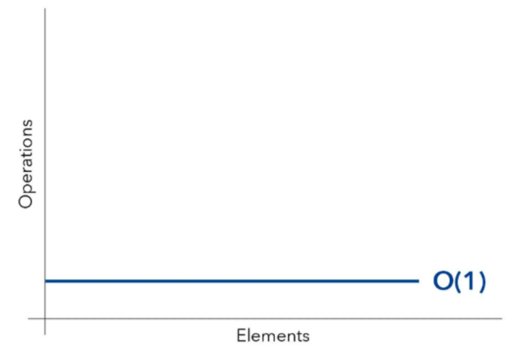
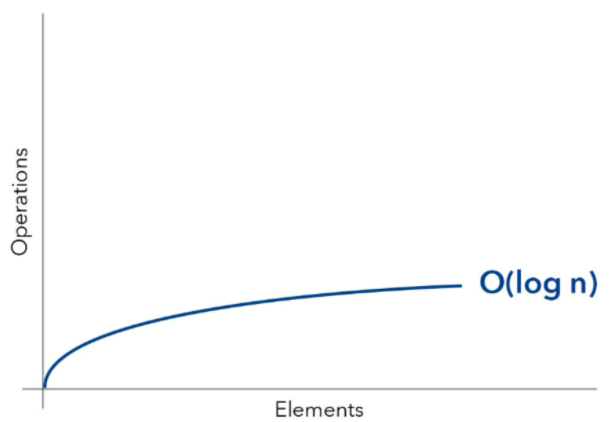
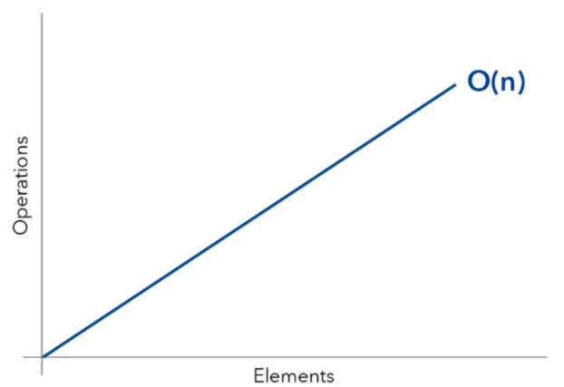
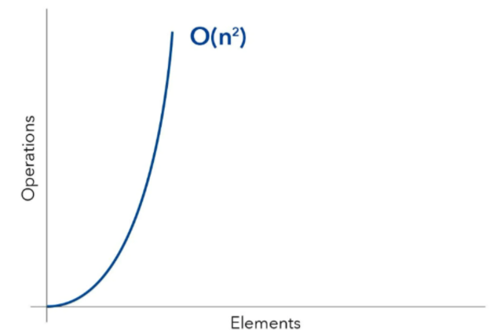

# Big O Notation

### Resources

[https://www.educative.io/blog/python-algorithms-coding-interview](https://www.educative.io/blog/python-algorithms-coding-interview)

[https://www.educative.io/blog/a-big-o-primer-for-beginning-devs](https://www.educative.io/blog/a-big-o-primer-for-beginning-devs)

### Definition

Big O notation is a form of asymptotic analysis that describes how long an algorithm runs. It’s a simple language for developers to quickly describe the performance or complexity of their algorithms.

Essentially, it’s a way to draw insights into how scalable an algorithm is. It doesn’t tell you how fast or how slow an algorithm will go, but instead about how it changes with respect to its input size.

Generally we use ‘worst-case’ scenarios when using Big O notaiton.

**Rule: ** Always drop constants .. even if the runtime complexity is O(2N), we write O(N).

**Rule: **Always drop less dominant terms .. for example O(N^3 + 50N + 17) is written O(N^3). The rule of thumb is:

**O(N!) **>** O(2^N) **>** O(N^2) **>** O(N log N) **>** O(N) **>** O(log N) **>** O(1)**

## Time Complexity

### **O(1) — Constant Time Complexity**

```
def getFirst(arr):
  return arr[0]
```

An algorithm runs in O(1) time if it runs at a constant time no matter its input.

In the above sample, the algorithm always executes at the same time, event if the array holds one element or 1000 elements, because it only requires one “step.”



### O(log N) — Logarithmic Time Complexity

In this case time increases linearly, while N increases exponentially. It might take 1 second to process 10 elements, 2 seconds to process 100 elements, and so on.

**Example: **Divide and Conquer algorithms such as binary search.



**O(N) — Linear Time Complexity**

```
def example(arr):
  for i in arr:
  print(i)
```

An algorithm runs in O(N) time if its runtime increases **lineraly** relative to its input **N**.

In above sample, the function will take one ‘step’ if the input has one element, and a thousand ‘steps’ if the input has a thousand elements.

**Example: **Depth First Search (DFS) of a tree



**O(N^2) — Quadratic Time Complexity**

```
def example(arr):
  for x in arr:
    for y in arr:
      print(x,y)
```

An algorithm runs in O(N^2) time if its runtime is directly proportional to the **square** of the input size.

The above sample has a nested loop; the outer loop executes N times, and the inner loop executes N times for each outer loop execution, such that the runtime is N^2.

**Example: **Bubble Sort and Insertion Sort


