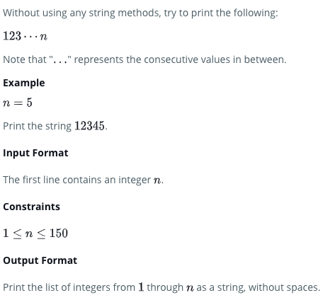

# Technical Interview Notes

REMEMBER to differentiate between EQUALS (==) and ASSIGNMENT OPERATOR (=)

## **Printing Sequences without String Manipulation**

[https://www.hackerrank.com/challenges/python-print/problem](https://www.hackerrank.com/challenges/python-print/problem)** **



**Solution:**

Use print() with a blank _sep_ argument, and use the range() iterator and \* to expand the sequence.

```
> print(*range(1,n+1), sep='')

12345
```

**TRICKY REGEX PROBLEMS**

[https://www.hackerrank.com/challenges/hex-color-code/problem](https://www.hackerrank.com/challenges/hex-color-code/problem)** **

Solution:

Use sys.stdin (an iterator) to parse input

Use RE Match Groups .. nested search() to determine if a line qualifies (has a colon, is a hex code), use finditer() to get all instances in a given line, then loop through iterator to print the group() attribute of each item.

```
import re
import sys

re_colon = re.compile(':') # creates a regex object
re_hex = re.compile('#[A-Fa-f0-9]{3,6}') # creates a regex object

for line in sys.stdin:
  if re_colon.search(line): # executes the regex object on the text, creates a match object w/metadata
    if re_hex.search(line):
      for i in re_hex.finditer(line):
        print(i.group())
```

**LIST COMPREHENSION (Multiple Iteration and Conditionals)**

[https://www.hackerrank.com/challenges/list-comprehensions/problem](https://www.hackerrank.com/challenges/list-comprehensions/problem)

Solution:

Multiple iteration, range +1, filter on sum of factors)

```
[(i,j,k) for i in range(0,x+1) for j in range(0,y+1) for k in range(0,z+1) if (i+j+k) < n]

[(0, 0, 0), (0, 0, 1), (0, 1, 0), (0, 1, 1), (1, 0, 0), (1, 0, 1), (1, 1, 0)]
```

**DATA TYPING**

[https://www.hackerrank.com/challenges/python-tuples/problem](https://www.hackerrank.com/challenges/python-tuples/problem)

Solution:

```
t = tuple(integer_list)
    print(hash(t))
```

**READ INPUT**

“Standard Input” or input from the command line

**sys.stdin **can be used to get input from the command line directly. It used is for standard input. It internally calls the input() method. It, also, automatically adds ‘\n’ after each sentence.

```
import sys

for line in sys.stdin:
  print(line)
```

the built-in input() accepts user input during execution

```
i = input('type something')
```

**PARSE INPUT**

* Chain** INPUT() **with **SPLIT() **and use Flexible Arguments to expand args into a sequence.

```
N = 2

for _ in range(N):
    cmd, *args = input().split()
    print(cmd, args)

>> name 1 2

name ['1', '1']
```

**SORTING AND MANIPULATING LISTS**

[https://www.hackerrank.com/challenges/nested-list/problem](https://www.hackerrank.com/challenges/nested-list/problem)** **

* for \_ in range with input()
* append() lists within lists
* sort complex lists
  * sorted() and lambda function
* iterate over list elements with for...in

```
# define master list  
results = []
names = []

# append sublists to master list
for _ in range(int(input())):
    name = input()
    score = float(input())  
    results.append([name, score])

# get second lowest score from master list
lowscore2 = sorted(results, key=lambda x:x[1])[1][1]

# get all names with lowscore
for r in results:
  if r[1] == lowscore2:
    names.append(r[0])

# alphabetize and print
for n in sorted(names):
    print(n)
```

**NUMBER FORMATTING with F-STRINGS**

[https://www.hackerrank.com/challenges/finding-the-percentage/problem](https://www.hackerrank.com/challenges/finding-the-percentage/problem)

* Force two decimal places on a number that rounds to one.
* Use F-STRINGS

```
round(result,2) = 28.0

print(f'{result:.2f}')
28.00
```

**EXECUTE COMMANDS FROM INPUT**

* Parse input with** INPUT() a**nd **SPLIT(), **expand arguments with **Flexible Arguments **(\*)
* Use string method **JOIN()** to concatenate arugments into command string
* Use string method **EXEC() **to execute command string

```
N = int(input())
list = []

for _ in range(N):
  # parse input
  cmd, *args = input().split()

  if cmd == 'print':
    print(list)
  else:
    # build command string
    my_cmd = 'list.' + cmd + '(' + ','.join(args) + ')'

    # execute command
    exec(my_cmd)
```

**STRING MANIPULATION**

* JOIN()
* SPLIT()
* COUNT()
* LEN()
* FIND(), RFIND() (and when to use IN instead)
* STRIP(), LSTRIP(), RSTRIP()
* SLICE NOTATION
* ..
* Traversing strings character-wise with for…in
  * Hint: Use List Comprehension instead

For this exercise, had to use a different method than COUNT() in order to find overlapping substrings. (COUNT only finds non-overlapping).

In this case, I got hung up on the use of FIND(). Advice is to use IN instead if you don’t need the index, just whether the substring exists.

```
def count_sub(string, sub_string):
    c = 0
    max = len(string) - len(sub_string) + 1

    for i in range(max):
        sample = string[i:i+len(sub_string)]
        #print('looking in ' + sample)

        if sub_string in sample:   
            c += 1
            #print('found')
    return c
```

**STRING VALIDATORS**

* Use of string methods ISALNUM, ISALPHA, ISDIGIT, ISLOWER, ISUPPER
* Boolean Math to evaluate each charater of string
* List Comprehension with IF/ELSE statement (note the different format!)
* Printing result using List Comprehension
* Use List Comprehensions everywhere for the test, way more sophisticated. Guide at
  * [https://data-flair.training/blogs/python-list-comprehension/](https://data-flair.training/blogs/python-list-comprehension/)

```
s = input()

list = [0,0,0,0,0]

for c in range(len(s)):

    # boolean math
    list[0] += s[c].isalnum()
    list[1] += s[c].isalpha()
    list[2] += s[c].isdigit()
    list[3] += s[c].islower()
    list[4] += s[c].isupper()

[print(True) if a > 0 else print(False) for a in list]
```

**LIST COMPREHENSION + STRINGS**

* String Manipulation in one go using IF/ELSE and JOIN

```
s = 'HackerRank.com presents "Pythonist 2".'

''.join([c.upper() if c.islower() else c.lower() for c in s])

'hACKERrANK.COM PRESENTS "pYTHONIST 2".'
```

**LIST COMPREHENSION + STRINGS**

[https://www.hackerrank.com/challenges/text-wrap/problem](https://www.hackerrank.com/challenges/text-wrap/problem)

* Use List Comp and Range (with step argument) and Slicing Notation to split string up into chunks
* Use join with newline character to reassemble into paragraph with new width

```
s = 'ABCDEFGHIJKLIMNOQRSTUVWXYZ'
n = 4

str = [s[i:i+n] for i in range(0, len(s), n)]
print('\n'.join(str))
```
